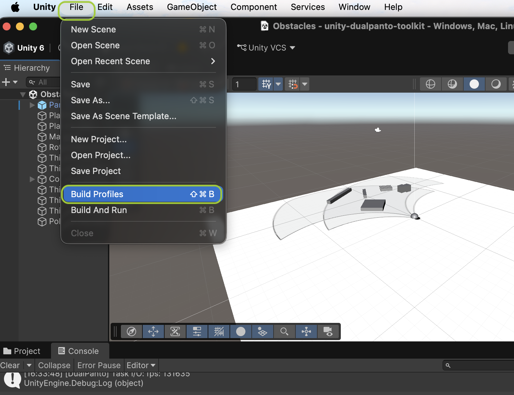
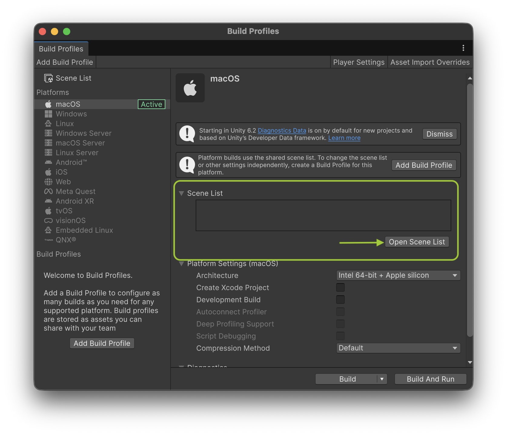
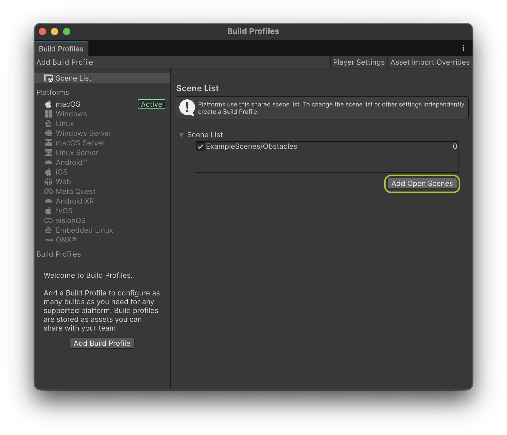
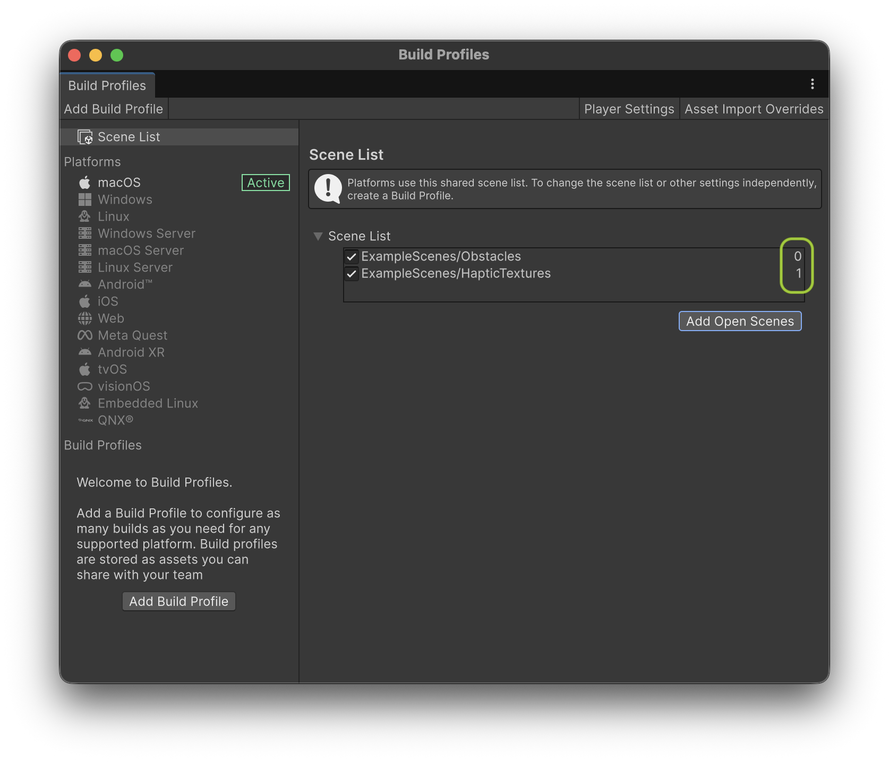
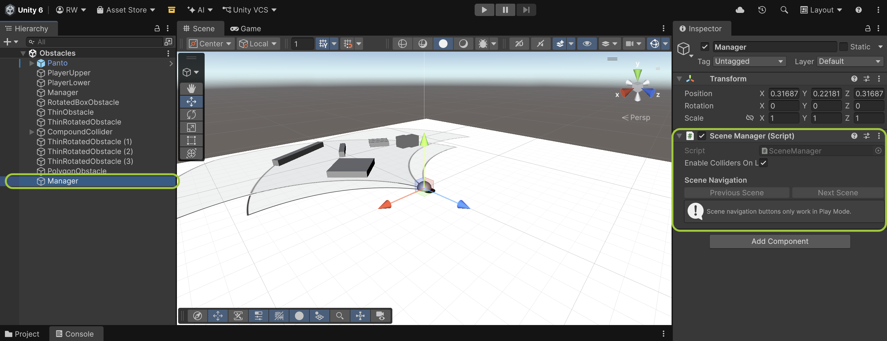

# Scene Manager

The `SceneManager` component lets a Panto application span multiple Unity scenes while keeping the DualPanto connection alive. It is a singleton that survives scene loads, automatically creates and enables all `PantoCollider`s in every scene it loads, and exposes simple navigation functions (`LoadScene`, `NextScene`, `PreviousScene`).

## :warning: Replacing the Obstacle Manager
`SceneManager` takes over the job that `ObstacleManager` used to do: after a scene finishes loading, it finds every `PantoCollider` in the scene, calls `CreateObstacle()` and enables (or disables) it, exactly like `ObstacleManager` did on `Start()`.

If your scene still has an `Obstacle Manager` component, **remove it** once you add the `Scene Manager`. Keeping both will create and enable every obstacle twice, which can exceed the amount of obstacles the DualPanto is able to store, and will register conflicting keyboard shortcuts (`E`/`D`).

## 1. Adding the Scene Manager to your scene
1. Create an empty GameObject in your first scene (e.g. name it `Manager`).
2. Attach the `Scene Manager` component to it.
3. Remove the `Obstacle Manager` component from your scene(s), if present, see above.

Since `SceneManager` calls `DontDestroyOnLoad` on itself, only add it once, in the first scene that gets loaded. It will keep working across every scene you load afterwards.

If you have other objects that should also survive scene loads (for example a settings or audio manager), attach the small `DontDestroyGameObject` helper script to them instead of implementing `DontDestroyOnLoad` yourself.

## 2. Adding your scenes to the Build Settings
Scenes are loaded by name or by their index in the Build Settings scene list, so every scene you want to switch to needs to be added there first.

1. Open `File -> Build Profiles` (`Shift+Cmd+B` / `Shift+Ctrl+B`).


2. In the Build Profiles window, click `Open Scene List` to open the shared Scene List.


3. With your first scene open in the editor, click `Add Open Scenes` to add it to the list. It will get build index `0`.


4. Open your next scene and click `Add Open Scenes` again. Repeat for every scene your application uses. The order in the list determines the build index of each scene (`0`, `1`, `2`, ...), which you can use with `LoadScene(int sceneIndex)`.


## 3. Usage
Access the singleton via `SceneManager.Instance` from anywhere in your code:

* `LoadScene(string sceneName)` / `LoadScene(int sceneIndex)`
Loads the given scene.

* `NextScene()` / `PreviousScene()`
Loads the next/previous scene in the Build Settings list, wrapping around at the start/end.

* `currentSceneIndex`
Returns the build index of the currently active scene.

* `enableCollidersOnLoad`
If true (default), all `PantoCollider`s found after loading a scene will be enabled automatically. Set it to false if you want to enable obstacles yourself, e.g. gradually using `ObstacleSphere`.

For example, a trigger that advances to the next level once the player reaches a goal object could look like this:

```csharp
using UnityEngine;
using DualPantoToolkit;

public class LevelGoal : MonoBehaviour
{
    private void OnTriggerEnter(Collider other)
    {
        if (!other.CompareTag("Player")) return;

        // load the next scene in the Build Settings list
        SceneManager.Instance.NextScene();

        // alternatively load a specific scene:
        // SceneManager.Instance.LoadScene("Level02");
    }
}
```

## 4. Testing scene navigation in the editor
While in Play Mode, select the `Manager` GameObject to see `Previous Scene` / `Next Scene` buttons in the inspector. They call the same functions as above and are useful for quickly testing transitions between your scenes.

